=====================================================
System zarządzania związkiem sportowym - specyfikacja
=====================================================

:Wykonanie: Paweł Maksimek, Mariusz Okulanis

.. raw:: pdf

    PageBreak

.. contents:: Spis treści

.. sectnum::

.. raw:: pdf

    PageBreak

Historia zmian
==============

==================  ================  ====================================
Nazwa dokumentu     Data modyfikacji  Wprowadzone zmiany
==================  ================  ====================================
Specyfikacja.docx   2013-10-12        Utworzenie dokumentu i stworzenie
                                      szkieletu.
Specyfikacja.docx   2013-10-19        Dodanie opisu wstępu (pkt 2) i
                                      uzupełnienie słownika.
Specyfikacja.docx   2013-11-05        Uzupełnienie wymagań funkcjonalnych,
                                      wstępu, słownika i definicji typów
                                      danych.
Specyfikacja.docx   2013-11-18        Uzupełnienie typów danych
specyfikacja.rst    2013-11-28        Migracja na format RST, przebudowa
                                      typów danych, reorganizacja
                                      wymagań funkcjonalnych
specyfikacja.rst    2013-11-30        Uzupełnienie historii zmian,
                                      zmiana formatowania słownika pojęć,
                                      dodanie informacji o panelach
                                      głównych do słownika pojęć i wymagań
                                      funkcjonalnych, uzupełnienie
                                      wymagań dotyczących zarządzania
                                      klubami, oraz zarządzania
                                      zawodnikami.
specyfikacja.rst    2013-12-03        Poprawki formatowania, poprawki
                                      literówek.
specyfikacja.rst    2013-12-03        Dodanie makiet do wymagań
                                      funkcjonalnych, uzupełnienie
                                      wymagań niefunkcjonalnych.
specyfikacja.rst    2013-12-09        Dodanie wymagań dotyczących
                                      wydarzeń, poprawa wymagań
                                      autoryzacji, poprawa zarysu systemu. 
==================  ================  ====================================

Wstęp
=====

Dokument ten jest specyfikacją informatycznego systemu służącego
do zarządzania związkiem sportowym. Zdefiniowane zostały tutaj: słownik
pojęć, definicje typów danych, zarys systemu, wymagania funkcjonalne
i niefunkcjonalne.

System ten przeznaczony jest do wykorzystania w dowolnym związku sportowym.
Ma on na celu ułatwienie zadania jakim jest zarządzanie owym związkiem.
Ułatwia on również również pracę klubom sportowym zarejestrowanym w związku.

Słownik pojęć
=============

Administrator systemu
    Osoba zarządzająca całym systemem.
    Jest odpowiedzialny za rejestrację kont klubów.
    Administrator posiada władzę do zatwierdzania akcji moderowanych.

Klub
    Użytkownik reprezentujący klub
    (zwany również menedżerem klubu), ma on możliwość rejestracji
    zawodników.

Rejestracja konta klubu
    Założenie konta klubu przez administratora.

Zawodnik
    Informacje o realnej osobie przypisanej do klubu,
    zawodnik nie ma możliwości logowania się do systemu.

Zatwierdzony zawodnik
    Zawodnik dla którego pole ``zatwierdzony`` jest ustawione na
    wartość ``true``.

Użytkownik
    Administrator lub Klub.

Akcja moderowana
    Akcja, która musi zostać zatwierdzona przez
    administratora, zatwierdzanie polega zaakceptowaniu danej akcji po
    ówczesnym kontakcie za pomocą wiadomości e-mail między użytkownikiem,
    administratorem

Wydarzenie
    Wydarzenie sportowe, wprowadzane do systemu przez
    administratora. Dodawane jest ono to kalendarza systemowego za pomocą,
    którego są wysyłane przypomnienia o Wydarzeniu opisane później.

Panel główny
    Inaczej: panel użytkownika. Strona startowa systemu, widoczna
    dla użytkownika tuż po jego zalogowaniu. Zawiera ona wszystkie
    akcje jakie może podjąć użytkownik (zależnie od jego uprawnień).

Usunięcie z potwierdzeniem
    Podczas próby usunięcia obiektu usuwającemu zostaje wyświetlony
    komunikat z informacją o akcji jaką próbuje wykonać i jej
    konsekwencjach. Zostaje również poproszony o wciśnięciu
    przycisku "Potwierdź", dopiero po naciśnięciu tego przycisku
    obiekt faktycznie zostaje usunięty.

Definicje typów danych
======================

Użytkownik
----------

``Użytkownik`` jest klasą reprezentującą użytkowników systemu
którzy mogą się do niego logować. To czy użytkownik jest administratorem
czy klubem jest określane poprzez sprawdzenie pola ``uprawnienia``.
Klasa ``Użytkownik`` określona jest polami:

    * ``login`` - login do systemu pole tekstowe - 4-32 znaków, może
      zawierać litery łacińskie (wielkie i małe), cyfry oraz podkreślenia,
      loginy użytkowników nie mogą się powtarzać.
    * ``hasło`` - hasło do systemu pole tekstowe - 8-32 znaków, może
      zawierać drukowalne znaki z tabeli ASCII, w bazie danych hasło
      przechowywane jest w formie zahashowanej (funkcja skrótu SHA-1).
    * ``email`` - adres e-mail, pole tekstowe wg. specyfikacji RFC
      adresu e-mail, adresy e-mail użytkowników nie mogą się powtarzać.
    * ``uprawnienia`` - uprawnienia użytkownika, jednoznakowe pole
      tekstowe, może przybierać wartości ``A`` (oznacza Administratora)
      oraz ``K`` (oznacza Klub); pole to nie może być zmienione z poziomu
      systemu, wszystkie utworzone z poziomu systemu konta otrzymują
      tą wartość ustawioną na ``K``.

Klub
----

``Klub`` jest klasą przechowującą podstawowe informacje na temat
klubu, listę zawodników grających w danym klubie oraz powiązanego
użytkownika systemu. Zdefiniowane są pola:

    * ``użytkownik`` - powiązany użytkownik systemu, relacja 1-1 do
      obiektu ``Użytkownik`` (do każdego klubu przypisany jest
      dokładnie jeden użytkownik, ten sam użytkownik nie może być
      przypisany do więcej niż jednego klubu).
    * ``nazwa`` - nazwa klubu, pole tekstowe - 4-48 znaków, może
      zawierać polskie litery (wielkie i małe) oraz cyfry.
    * ``licencja`` - numer licencji klubu, pole tekstowe 4-50 znaków.

Zawodnik
--------

Klasa ``Zawodnik`` reprezentuje realnego zawodnika:

    * ``klub`` - klub do którego przypisany jest zawodnik, każdy
      zawodnik może być przypisany do tylko jednego klubu.
    * ``imie`` - imię zawodnika, pole tekstowe 4-32 znaków,
      zawiera polskie znaki.
    * ``nazwisko`` - nazwisko zawodnika, pole tekstowe 4-32 znaków,
      zawiera polskie znaki.
    * ``stan`` - stan zdrowia zawodnika, pole wyboru,
      może przybierać wartości: ``zdrowy``, ``lekka kontuzja``,
      ``ciężka kontuzja``, ``inne``.
    * ``stan_opis`` - dodatkowy opis stanu zdrowia zawodnika,
      jeśli wartość pola ``stan`` jest inna niż ``inne`` to pole
      jest nieobowiązkowe.
    * ``zdjęcie`` - zdjęcie zawodnika, zdjęcie w formacie JPG o rozmiarze
      do 100 kB, pole nieobowiązkowe.
    * ``ostatnie_badanie`` - data ostatniego badania okresowego,
      pole wyboru daty.
    * ``zatwierdzony`` - informacja czy zawodnik został zatwierdzony
      przez administratora, pole typu boolean
      (przyjmuje tylko wartości ``true`` i ``false``),
      pole to zmienione może być tylko przez administratora,
      domyślnie przyjmuje wartość ``false``.

Wydarzenie
----------

Klasa reprezentująca wydarzenia sportowe, określona jest polami:

    * ``nazwa`` - krótka nazwa wydarzenia, pole tekstowe 4-64 znaków.
    * ``data`` - dzień w którym ma się odbyć wydarzenie, pole wyboru
      daty.
    * ``czas`` - godzina o której ma się odbyć wydarzenie, pole wyboru
      godziny, pole nieobowiązkowe.
    * ``opis`` - opis wydarzenia, pole tekstowe 10-5000 znaków.
    * ``kluby`` - lista klubów zapisanych na wydarzenie, lista obiektów
      klasy ``Klub``.

Zarys systemu
=============

Celem systemu jest usprawnienia zarządzania związkiem sportowym.
Administrator systemu ma możliwość dodawania nowych klubów do systemu.
Dodane kluby mają możliwość edycji swoich danych oraz dodawanie
zawodników do swojej listy. Takie dodanie zawodnika musi
zostać zatwierdzone przez administratora. Administrator
ma możliwość dodawania wydarzeń. O dodanych wydarzeniach informowani
są menedżerowie klubów, którzy mogą zgłosić swoją chęć uczestnictwa
w wydarzeniu.

Wymagania funkcjonalne
======================

Autoryzacja
-----------

Logowanie
^^^^^^^^^

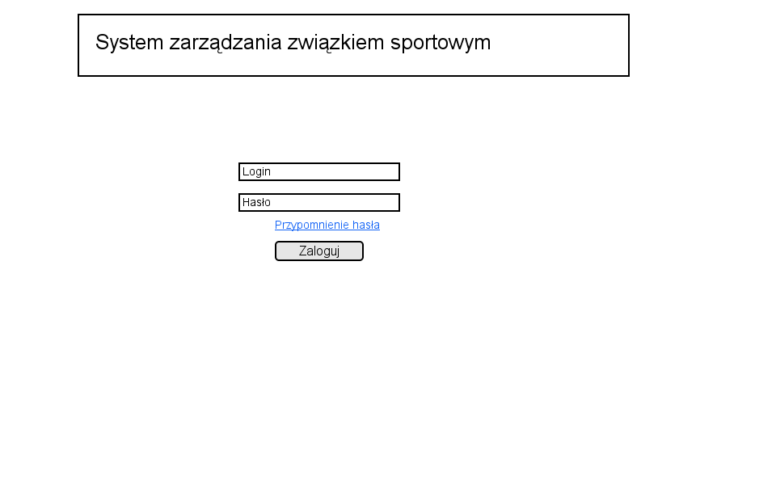

* Korzystać z tej funkcji może tylko niezalogowany użytkownik.
* System umożliwia użytkownikowi wprowadzenie loginu i hasła.
* Po wciśnięciu przycisku "Zaloguj" system sprawdza czy istnieje
  użytkownik o takim loginie i haśle.
* Jeśli taki użytkownik istnieje to niezalogowany użytkownik
  zostaje zalogowany jako on oraz przekierowany na stronę
  panelu głównego.
* Jeśli nie udało się znaleźć pasującego użytkownika wyświetlony
  zostaje komunikat "Niepoprawny login lub hasło", a niezalogowany
  użytkownik jest przekierowywany na stronę logowania do systemu.

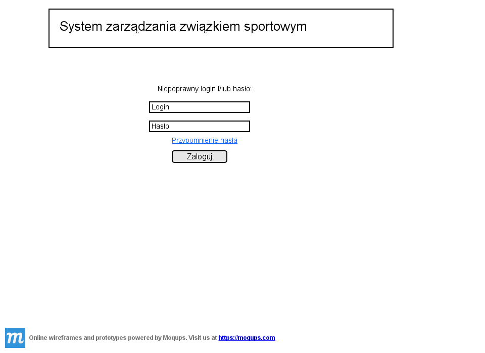

Zmiana hasła
^^^^^^^^^^^^

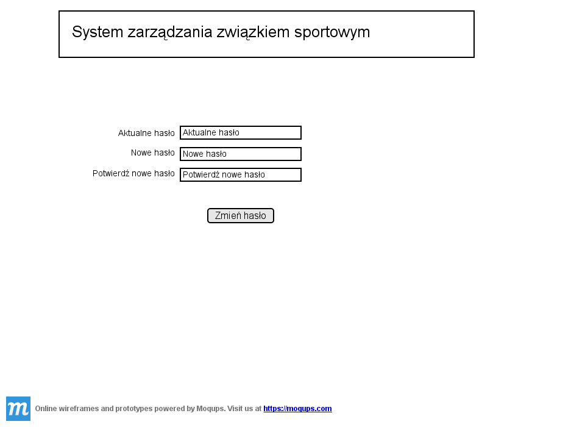

* Korzystać z tej funkcji może tylko zalogowany użytkownik.
* Wyświetlana jest strona z formularzem do wypełnienia.
* Po wciśnięciu przycisku "Zmień hasło" wykonywane jest sprawdzenie
  poprawności pól:

  #. czy pole "Aktualne hasło" zawiera obecne hasło użytkownika,
  #. czy pola "Nowe hasło" i "Potwierdź nowe hasło" mają taką samą zawartość,
  #. czy pole pole "Nowe hasło" zawiera hasło zgodne ze specyfikacją
     z punktu 4.1 (pole ``hasło``).

* Jeśli powyższe wymagania zostaną spełnione hasło użytkownika
  zostanie zmienione, a użytkownik zostanie przekierowany
  na stronę panelu głównego.

* W przeciwnym przypadku użytkownik zostanie przekierowany na stronę
  zmiany hasła oraz wyświetlony zostanie mu jeden lub więcej z
  poniższych komunikatów:
 
   + "Niepoprawne aktualne hasło"
     (jeśli niespełniony został warunek 1.),
   + "Nowe hasło w dwóch polach różni się od siebie"
     (jeśli niespełniony został warunek 2.),
   + "Nieprawidłowe nowe hasło"
     (jeśli niespełniony został warunek 3.).

Przypomnienie hasła
^^^^^^^^^^^^^^^^^^^

.. note::

   Obrazek do poprawy!!!

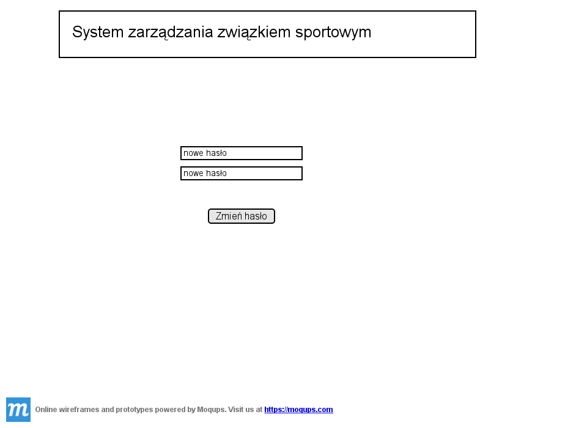

* Korzystać z tej funkcji może tylko niezalogowany użytkownik.
* Wyświetlana jest strona z formularzem gdzie użytkownik
  może podać login oraz adres e-mail.
* Po wciśnięciu przycisku "Przypomnij hasło" system sprawdza czy
  w systemie istnieje użytkownik o podanym loginie i adresie e-mail.
* Jeśli taki użytkownik istnieje to:
 
  + jego hasło zostaje zmienione na losowo wygenerowany 10-znakowy
    ciąg znaków (zgodny ze specyfikacją z punktu 4.1),
  + do użytkownika zostaje wysłany e-mail zawierający wygenerowane
    hasło,
  + niezalogowany użytkownik zostaje przekierowany na stronę
    logowania.

* Jeśli taki użytkownik nie istnieje to niezalogowany użytkownik
  zostaje przekierowany na stronę przypomnienia hasła i
  wyświetlony zostaje mu komunikat: "Niepoprawny login lub e-mail".

.. note::

   Obrazek do poprawy!!!

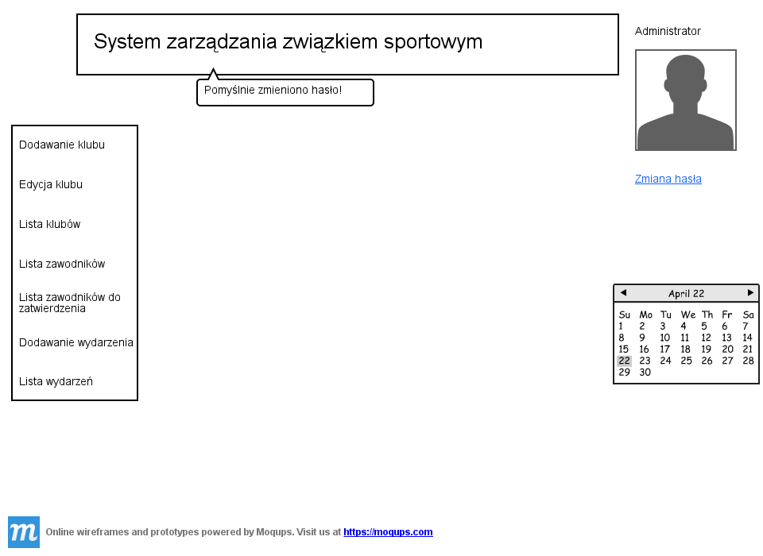

Panel główny administratora
^^^^^^^^^^^^^^^^^^^^^^^^^^^

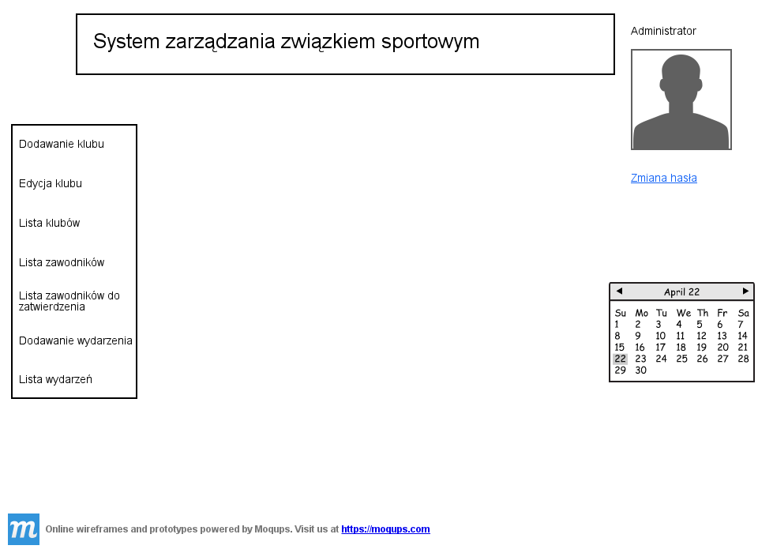

* Panel ten jest dostępny tylko dla administratora
* W panelu wyświetlana jest lista najbliższych nadchodzących wydarzeń
  (maksymalnie 10 wydarzeń na liście).
* Udostępnia on następujące opcje:

  + Dodawanie klubu
  + Lista klubów
  + Lista zawodników
  + Lista zawodników do zatwierdzenia
  + Zmiana hasła (swojego)
  + Dodawanie wydarzenia
  + Lista wydarzeń

Panel główny klubu
^^^^^^^^^^^^^^^^^^

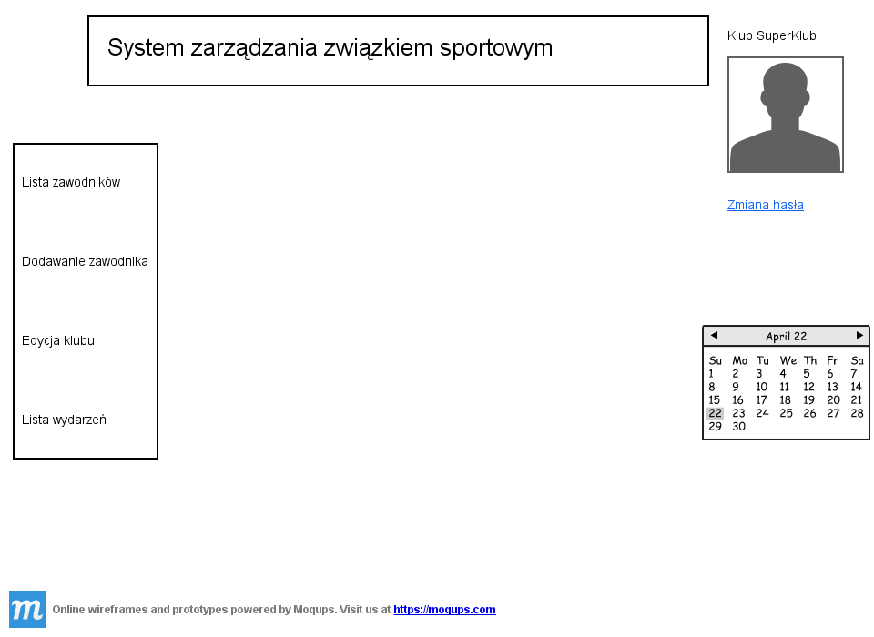

* Panel ten jest dostępny tylko dla klubu
* W panelu wyświetlana jest lista najbliższych nadchodzących wydarzeń
  (maksymalnie 10 wydarzeń na liście).
* Udostępnia on następujące opcje:

  + Edycja klubu
  + Dodawanie zawodnika
  + Lista zawodników
  + Zmiana hasła (swojego)
  + Lista wydarzeń

Zarządzanie klubami
-------------------

Dodanie klubu
^^^^^^^^^^^^^

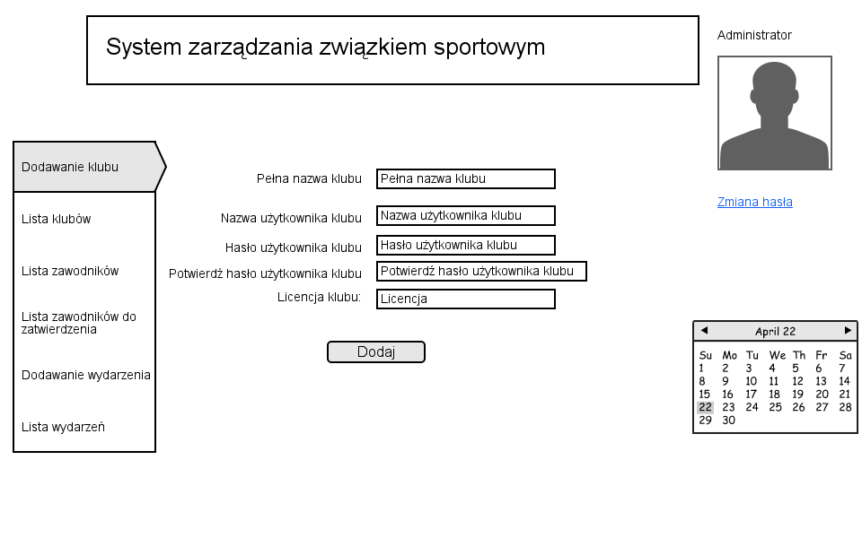

* Korzystać z tej funkcji może tylko administrator.
* W celu dodania klubu administrator musi wypełnić pola klas
  ``Klub`` i ``Użytkownik``.
* Naciśnięcie przycisku "Dodaj" powoduje sprawdzenie poprawności
  pól.
* Jeśli nie zostaną spełnione wymagania pól, wyświetlony zostanie
  komunikat z prośbą o poprawienie błędnych pól.
* Jeśli wszystkie pola są poprawne to zostaną utworzone obiekty
  klas ``Klub`` i ``Użytkownik``, które następnie zostaną
  ze sobą powiązane.
* Po udanym dodaniu klubu dodający zostaje przekierowany
  na stronę panelu głównego.

Lista klubów
^^^^^^^^^^^^

* Korzystać z tej funkcji może tylko administrator.
* Wyświetlona zostaje kompletna lista klubów w systemie.
* Wybranie klubu z listy przekierowuje do jego edycji.

Edycja klubu (z poziomu administratora)
^^^^^^^^^^^^^^^^^^^^^^^^^^^^^^^^^^^^^^^

* Korzystać z tej funkcji może tylko administrator.
* Edytujący może edytować pola obiektu klasy ``Klub``
  oraz powiązanego z nim obiektu klasy ``Użytkownik``.
* Naciśnięcie przycisku "Zapisz" powoduje sprawdzanie poprawności
  pól,

  + jeśli pola są wypełnione poprawnie, zmiany w obiektach
    zostają zapisane, a użytkownik zostaje przekierowany
    do listy klubów,
  + jeśli pola są błędnie wypełnione zostaje wyświetlony
    komunikat z prośbą o poprawę błędów.

* Przycisk "Usuń" powoduje usunięcie klubu i powiązanego
  z nim użytkownika z bazy. Usunięcie nie następuje
  natychmiast - usuwającemu wyświetlony zostaje komunikat
  z informacją o skutkach tej akcji i prośbą o potwierdzenie.

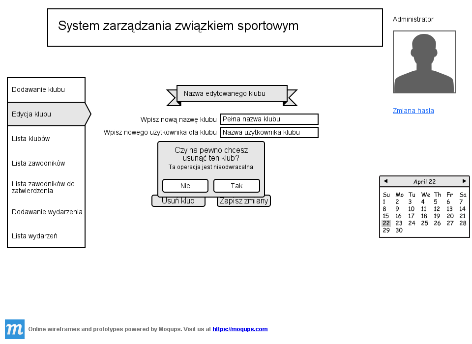

Edycja klubu (z poziomu klubu)
^^^^^^^^^^^^^^^^^^^^^^^^^^^^^^

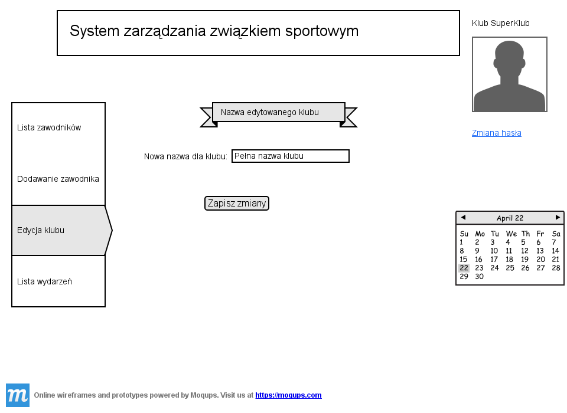

* Korzystać z tej funkcji może tylko klub.
* Edytujący może edytować pola obiektu klasy ``Klub``.
* Naciśnięcie przycisku "Zapisz" powoduje sprawdzanie poprawności
  pól,

  + jeśli pola są wypełnione poprawnie, zmiany w obiektach
    zostają zapisane, a użytkownik zostaje przekierowany
    do panelu głównego,
  + jeśli pola są błędnie wypełnione zostaje wyświetlony
    komunikat z prośbą o poprawę błędów.

Zarządzanie zawodnikami
-----------------------

Dodanie zawodnika
^^^^^^^^^^^^^^^^^

.. image:: img/dodanie_zawodnika,_klub_(15).png
   :width: 100%

* Korzystać z tej funkcji może tylko klub.
* W celu dodania zawodnika użytkownik musi wypełnić pola
  obiektu klasy ``Zawodnik``
* Naciśnięcie przycisku "Dodaj" powoduje sprawdzenie poprawności
  pól.
* Jeśli nie zostaną spełnione wymagania pól, wyświetlony zostanie
  komunikat z prośbą o poprawienie błędnych pól.
* Jeśli wszystkie pola są poprawne to zostanie stworzony obiekt
  klasy ``Zawodnik`` który zostanie powiązany z obiektem
  klasy ``Klub`` obecnego użytkownika.
* Po udanym dodaniu zawodnika dodający zostaje przekierowany
  na stronę panelu głównego.

Lista zawodników (z poziomu administratora)
^^^^^^^^^^^^^^^^^^^^^^^^^^^^^^^^^^^^^^^^^^^

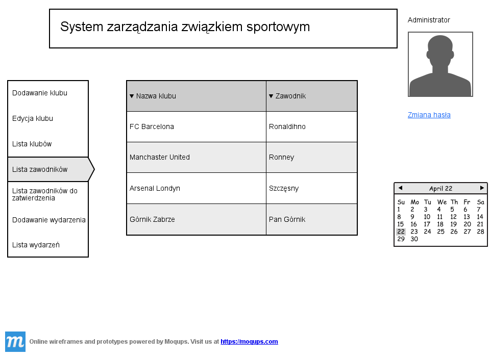

* Korzystać z tej funkcji może tylko administrator.
* Wyświetlona zostaje lista zatwierdzonych zawodników, wraz
  z informacją do którego klubu są przypisani.
* Wybranie zawodnika z listy powoduje rozpoczęcie jego edycji.

Lista zawodników (z poziomu klubu)
^^^^^^^^^^^^^^^^^^^^^^^^^^^^^^^^^^

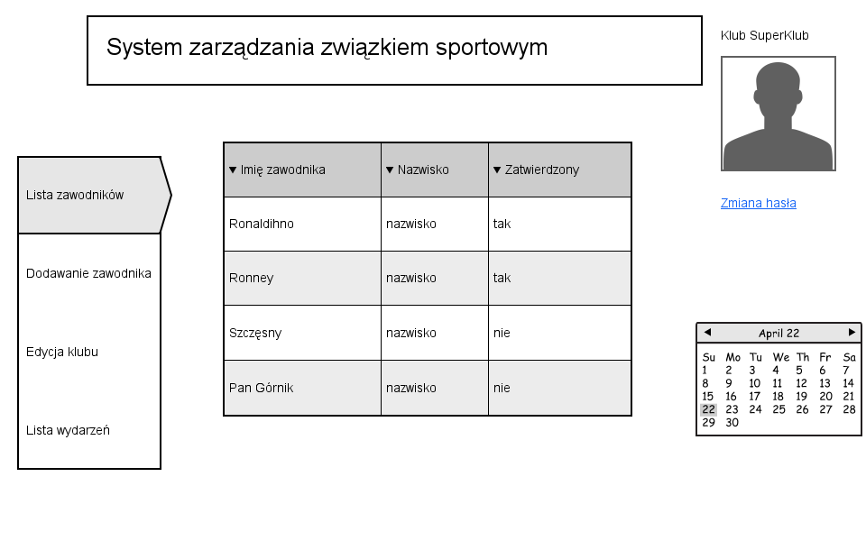

* Korzystać z tej funkcji może tylko klub.
* Wyświetlona zostaje lista zawodników przypisanych do klubu użytkownika,
  wraz z informacją czy zawodnik ten jest zatwierdzony.
* Wybranie zawodnika z listy powoduje rozpoczęcie jego edycji.

Edycja zawodnika
^^^^^^^^^^^^^^^^

* Korzystać z tej funkcji może klub oraz administrator.
* Po wcześniejszym wybraniu zawodnika wyświetlana jest strona z 
  profilem tego zawodnika z możliwością edycji jego danych.
* Po wybraniu zdjęcia wyświetlane jest okno systemowe do wyboru pliku z
  nowym zdjęciem zawodnika.
* Po wybraniu przycisku "Zapisz" system sprawdza poprawność edytowanych pól,
  jeśli któreś są niepoprawne pojawia się napis przy tych polach z informacją
  o tym, że są niepoprawne. W przypadku gdy wszystkie pola są poprawne
  system aktualizuje dane w bazie danych tego zawodnika i wyświetla okno
  z informacją o poprawnej edycji danych zawodnika. 

Lista zawodników do zatwierdzenia
^^^^^^^^^^^^^^^^^^^^^^^^^^^^^^^^^

* Korzystać z tej funkcji może tylko administrator.
* Wyświetlona zostaje lista niezatwierdzonych zawodników, wraz
  z informacją do którego klubu są przypisani.
* Wybranie zawodnika z listy powoduje przekierowanie do jego zatwierdzania.

Zatwierdzenie zawodnika
^^^^^^^^^^^^^^^^^^^^^^^

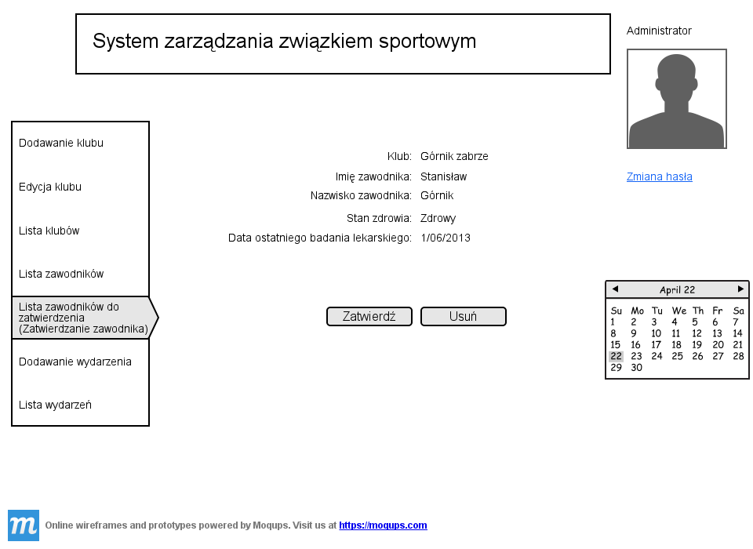

* Korzystać z tej funkcji może tylko administrator.
* Wyświetlone zostają informacje o zawodniku.
* Naciśnięcie przycisku "Zatwierdź" powoduje ustawienie
  pola ``zatwierdzony`` danego na Zawodnika na wartość
  ``true``.
* Naciśnięcie przycisku "Usuń" powoduje usunięcie z
  potwierdzeniem danego zawodnika.
* Po zatwierdzeniu lub usunięciu zawodnika użytkownik
  zostaje przekierowany na stronę listy zawodników
  do zatwierdzenia.

Wydarzenia
----------

Lista wydarzeń (z poziomu administratora)
^^^^^^^^^^^^^^^^^^^^^^^^^^^^^^^^^^^^^^^^^

* Korzystać z tej funkcji może tylko administrator.
* Wyświetlona zostaje kompletna lista wydarzeń.
* Wybranie wydarzenia z listy przekierowuje do jego edycji.

Lista wydarzeń (z poziomu klubu)
^^^^^^^^^^^^^^^^^^^^^^^^^^^^^^^^

* Korzystać z tej funkcji może tylko klub.
* Wyświetlona zostaje kompletna lista wydarzeń, wraz z informacją
  czy klub jest na to wydarzenie zapisany.
* Wybranie wydarzenia z listy przekierowuje do dołączania na wydarzenie,
  bądź rezygnacji z udziału w nim (zależnie od tego czy klub jest już
  na to wydarzenie zapisany).

Dodawanie wydarzenia
^^^^^^^^^^^^^^^^^^^^

* Korzystać z tej funkcji może tylko administrator.
* Użytkownik może wypełnić pola obiektu ``Wydarzenie``.
* Naciśnięcie przycisku "Dodaj" powoduje sprawdzenie poprawności
  pól.
* Jeśli nie zostaną spełnione wymagania pól, wyświetlony zostanie
  komunikat z prośbą o poprawienie błędnych pól.
* Jeśli wszystkie pola są poprawne to zostanie utworzony obiekt
  ``Wydarzenie``.
* Po udanym dodaniu wydarzenia użytkownik zostaje przekierowany
  na stronę panelu głównego.

Edycja wydarzenia
^^^^^^^^^^^^^^^^^

* Korzystać z tej funkcji może tylko administrator.
* Użytkownik może edytować pola obiektu ``Wydarzenie``.
* Naciśnięcie przycisku "Zapisz" powoduje sprawdzanie poprawności
  pól,

  + jeśli pola są wypełnione poprawnie, zmiany w wydarzeniu
    zostają zapisane,
  + jeśli pola są błędnie wypełnione zostaje wyświetlony
    komunikat z prośbą o poprawę błędów.

* Przycisk "Usuń" powoduje usunięcie z potwierdzeniem
  danego wydarzenia.
* Po zapisaniu lub usunięciu wydarzenia użytkownik zostaje
  przekierowany na stronę listy wydarzeń.

Dołączenie do wydarzania
^^^^^^^^^^^^^^^^^^^^^^^^

* Korzystać z tej funkcji może tylko klub.
* Korzystać z tej funkcji można tylko wtedy, gdy
  klub nie jest zapisany na dane wydarzenie.
* Wyświetlone zostają informacje o wydarzeniu.
* Naciśnięcie przycisku "Dołącz" powoduje zapisanie klubu
  na wydarzenie poprzez dopisanie go listy
  ``kluby``, dla obecnego wydarzenia.
* Po dołączeniu do wydarzenia użytkownik zostaje przekierowany
  na stronę listy wydarzeń.

Rezygnacja z udziału w wydarzeniu
^^^^^^^^^^^^^^^^^^^^^^^^^^^^^^^^^

* Korzystać z tej funkcji może tylko klub.
* Korzystać z tej funkcji można tylko wtedy, gdy
  klub jest już zapisany na dane wydarzenie.
* Wyświetlone zostają informacje o wydarzeniu.
* Naciśnięcie przycisku "Rezygnuj" powoduje usunięcie aktualnego
  klubu z listy ``kluby``, dla obecnego wydarzenia.
* Po rezygnacji z udziału w wydarzeniu użytkownik
  zostaje przekierowany
  na stronę listy wydarzeń.

Wymagania niefunkcjonalne
=========================

Dostępność z urządzeń mobilnych
-------------------------------

Strona systemu powinna być dostępna z urządzeń mobilnych
oraz poprawnie na nich wyświetlana.

